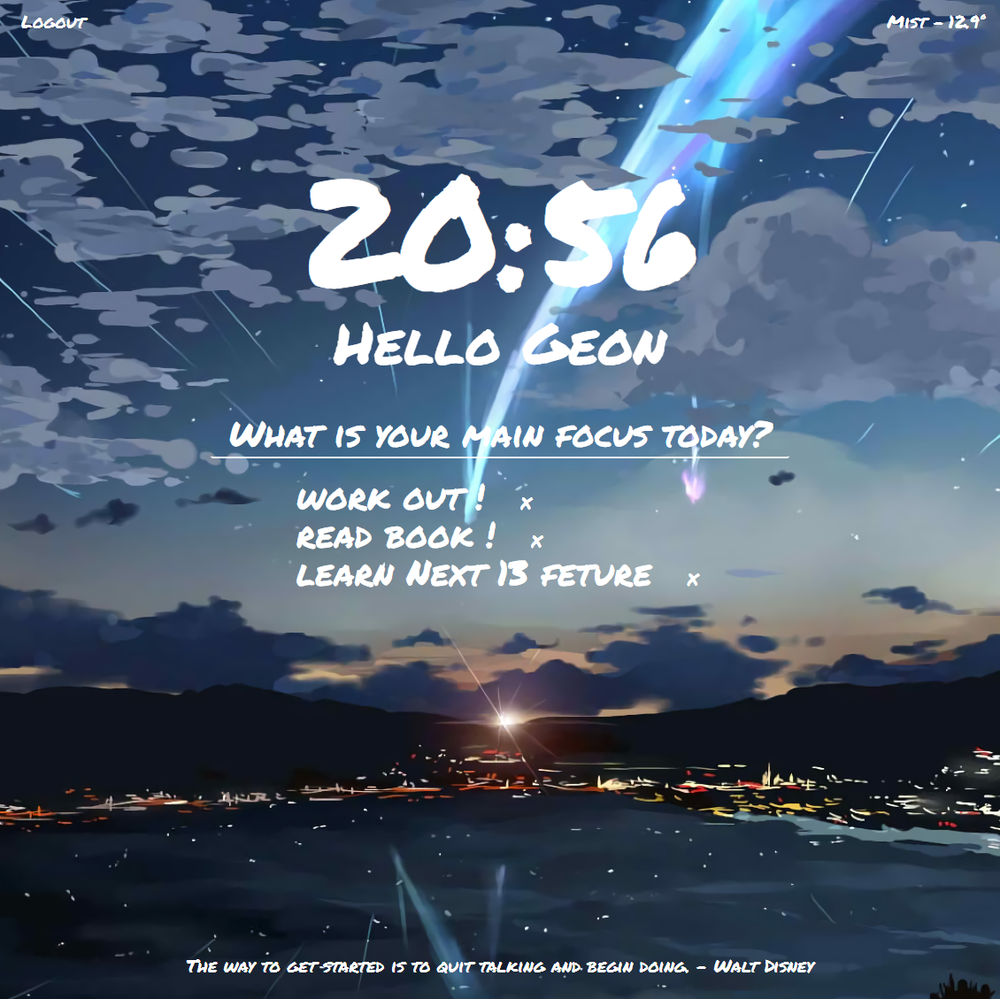
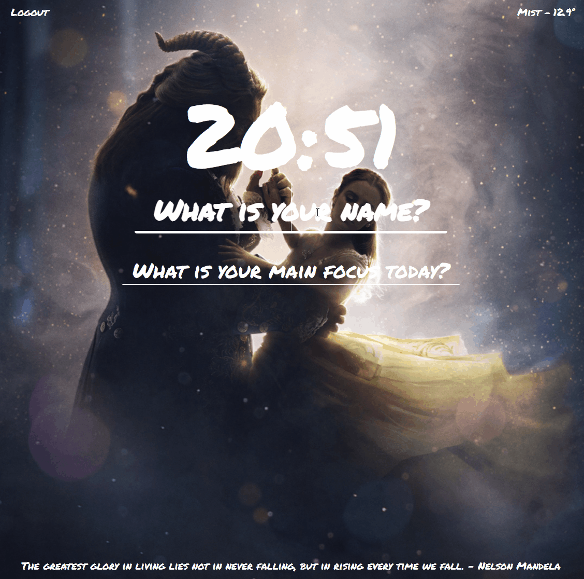
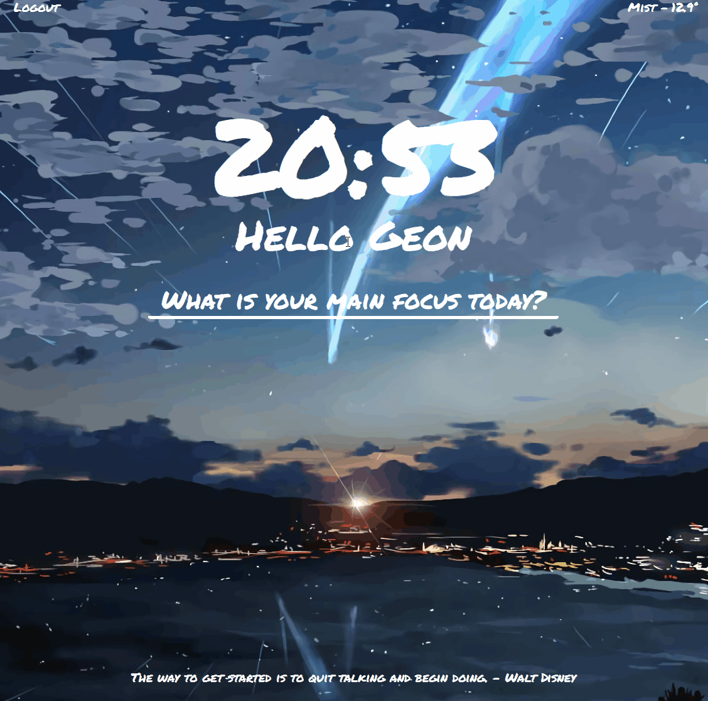

  <a href="https://new-videoplayer-nodejs.herokuapp.com">
    
      
    <a display="block" href="https://geon1999.github.io/momentom_js">모멘텀 클론</a>
  </a>

  

## Preview 

 

 #### 1. 홈
 - 배경화면이 랜덤하게 노출되도록 구현
  1. 배경화면의 이름을 1~18.jpeg 로 지정
  2. `Math.floor(Math.random() * images.length)` 배경화면의 length 안에서 랜덤한 숫자가 나오도록 설정
  3. 배경화면의 경로를 `img/2번에서 나온 랜덤한 숫자` 로 지정
 - 하단에 명언이 랜덤하게 노출되도록 구현(배경화면과 유사하게 구현)
 - 이름을 입력시 캐시에 해당 이름을 저장하도록 구현
 - 로그아웃 버튼 클릭시 저장된 모든 캐시 삭제하도록 구현
 - 위치 정보 제공에 동의시 해당 지역의 날씨 정보 제공
 

  
 

 

 

 #### 2. ToDo List

 

  
 

 
  

  
 

## Built with

> Front-end

 

> Back-end

 

> Deploy
- Github
   
